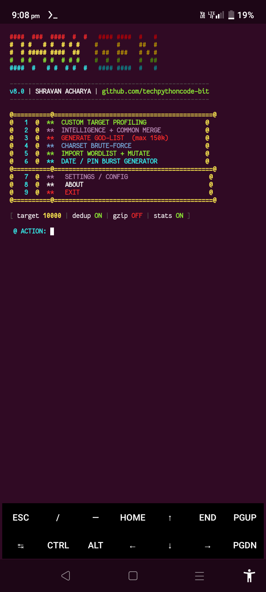
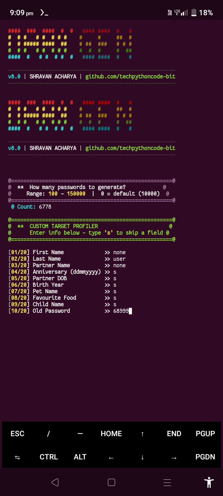
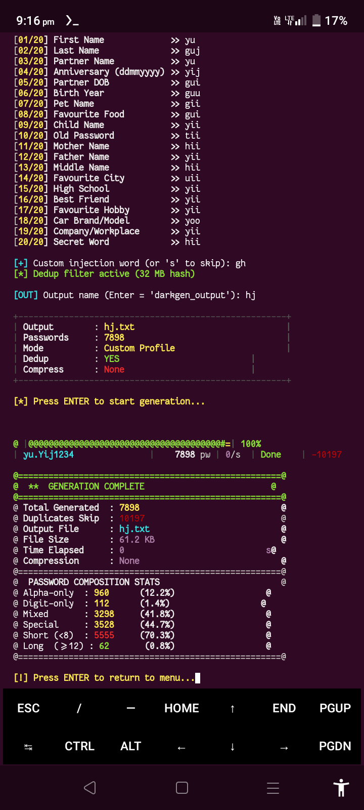
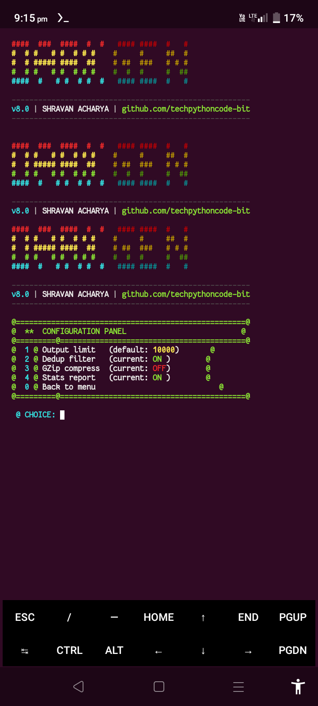
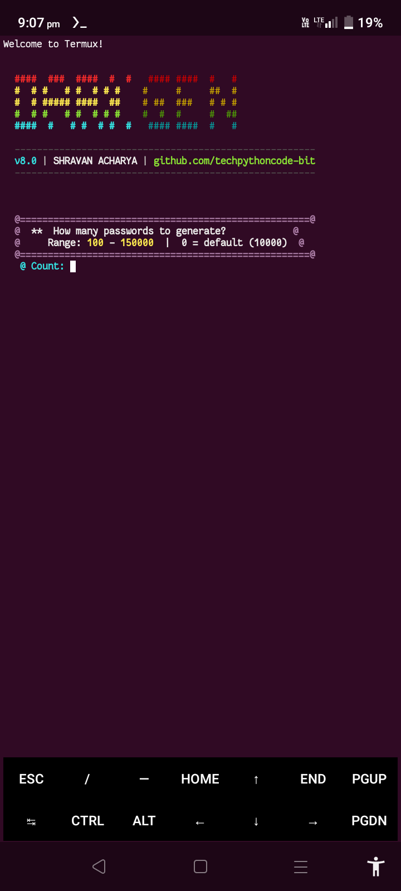

<h1 align="center">🌑 DARKGEN_PROFILER</h1>

<p align="center">
  
  
  
  
</p>

<p align="center">
  <b>Darkgen Profiler</b> is a professional-grade intelligence suite designed to create personalized password lists. By leveraging target-specific data—names, dates, and habits—it generates highly probable wordlists for security researchers.
</p>

---

## 📸 Screenshots

<p align="center">
  
  
  
  

  
</p>

---

## 🛠️ Key Features
* **🎯 Target Profiling:** Advanced mutations based on personal intelligence.
* **⚡ Pure C Engine:** Built from scratch in C for maximum speed and efficiency.
* **🧹 FNV-1a Dedup:** Integrated 32MB hash-table to remove duplicates on the fly.
* **📦 GZip Compression:** Level 9 compression support for massive datasets.
* **📊 Real-time Stats:** Instant breakdown of Alpha, Digit, and Special character ratios.

---

## 🚀 Installation & Execution

### 📱 Termux
Darkgen is written **purely in C**, ensuring it runs lightning-fast even on mobile hardware.

```bash
# Update and install dependencies
pkg install gcc make zlib -y

# Compile the source (The Core Engine)
gcc drkgen.c -o drkgen -lpthread -lm -lz -O3

# Run the Profiler
./drkgen
```

#### 🐧 Kali Linux/Debian
```bash
Kali requires build-essential for the compiler and zlib1g-dev for the header files needed during compilation.
# Update the system repositories
sudo apt update && sudo apt full-upgrade -y

# Install compilation dependencies
sudo apt install build-essential zlib1g-dev -y

# Compile the source
gcc drkgen.c -o drkgen -lpthread -lm -lz -O3

# Grant execution permissions (if needed) and run
chmod +x drkgen
./drkgen
```


Mode Action
```
1. Custom Profiler Full intelligence gathering and mutation.
2. Intel Merge Mixes target info with 500+ common passwords.
3. God-List Generates high-entropy "Elite" password lists.
4. Brute-Force Recursive charset generation (custom length).
5. Mutator Import an existing list and apply Darkgen rules.
```

👤 Author
Shravan Acharya
GitHub: techpythoncode-bit
Email: techpythoncode@gmail.com
<p align="center">
  <a href="https://www.youtube.com/channel/YOUR_CHANNEL_ID?sub_confirmation=1" 
     style="text-decoration: none; display: inline-flex; align-items: center; gap: 10px;">
    
     
    
    
    
    <span style="font-family: sans-serif; font-weight: bold; color: #ff0000;">Subscribe</span>
  </a>
</p>

</p>
<p align="center">
<i>Developed for ethical security testing and research purposes only.</i>
</p>

<p align="center">


<b>Thanks for using Darkgen! Stay Ethical.</b>
</p>
